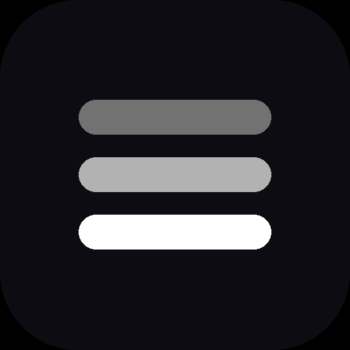
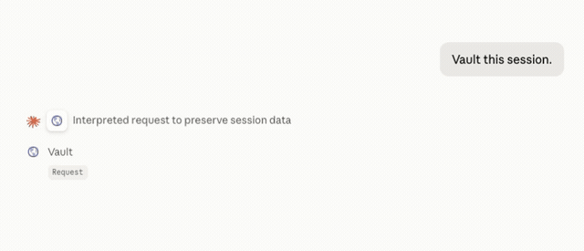
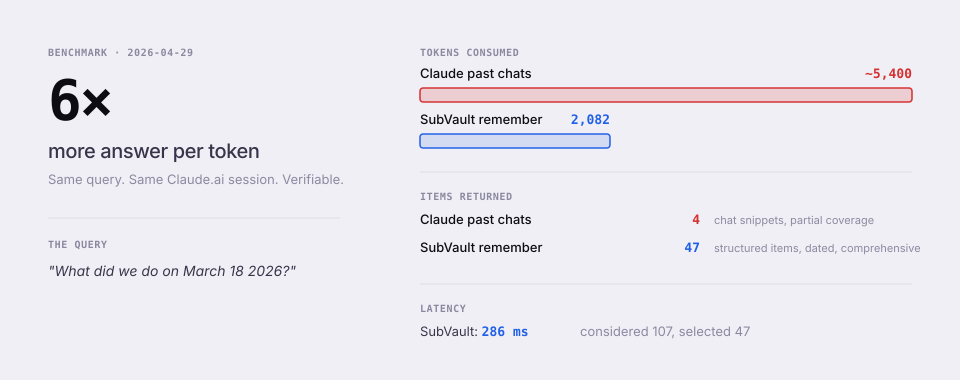
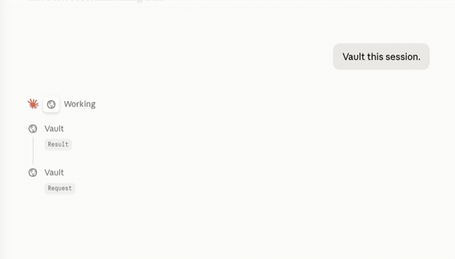
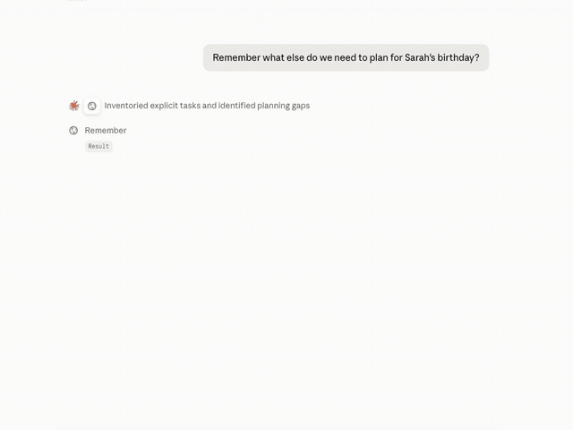
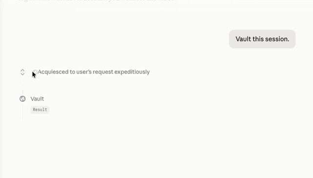
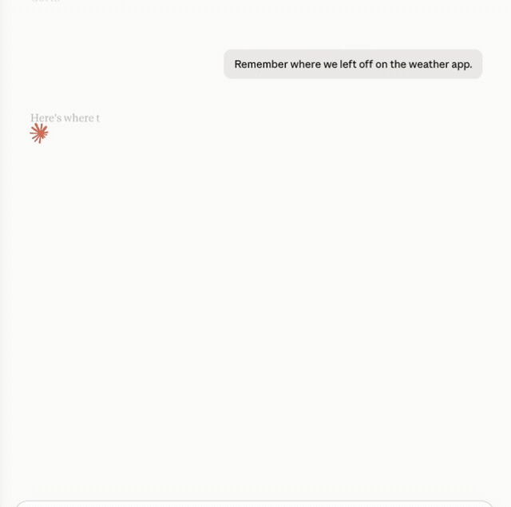

<p align="center">
  
</p>

<h1 align="center">SubVault</h1>

<p align="center">
  <strong>Shared memory for your AI tools.</strong>
</p>

<p align="center">
  <a href="https://subvault.ai"></a>
  <a href="LICENSE"></a>
  <a href="https://modelcontextprotocol.io"></a>
  <a href="SECURITY.md"></a>
</p>

<p align="center">
  
</p>

---

## One memory across every AI tool

SubVault is an MCP server that gives Claude, Cursor, ChatGPT, and Copilot permanent memory. Two words — `remember` and `vault` — and your AI never starts from zero.

## What it is

A memory layer for AI tools. You connect it to anything that speaks MCP. The tools share a single vault. What you save in one, you can recall in the others.

## What it stores

Facts, decisions, action items, and people. Not chat transcripts. Each item is a structured record with date, source, and links to related items.

## Smaller prompts, sharper recall

<p align="center">
  
</p>

SubVault returns extracted knowledge — facts, decisions, action items — not chat transcripts. Less to read, more to act on, fewer tokens consumed.

We ran the same query through both systems in the same Claude.ai session.

| | Claude past chats | SubVault `remember` |
|---|---:|---:|
| Tokens consumed | ~5,400 | **2,082** |
| Items returned | 4 chat snippets | **47 structured items** |
| Date accuracy | mixed — surfaced unrelated April content | all items dated to the queried day |
| Coverage of the query | partial | comprehensive |
| Latency | not exposed | **286 ms** |
| **Answer per token** | baseline | **~6× better** |

<details>
<summary><strong>Methodology</strong></summary>

**Date:** 2026-04-29
**Environment:** Claude.ai web, single session, both retrieval systems available
**Query:** *"What did we do on March 18 2026?"* — a realistic project-resumption question, intentionally older than recent chats so recency-decay matters
**Test 1:** `conversation_search` only (Claude's built-in past-chats)
**Test 2:** `subvault:remember` only (mode: contextual)

**How the tokens were counted.** The SubVault count is reported precisely by the assembler in the response footer (`tokens: 2082`). Claude's past-chats system does not expose its token cost; the ~5,400 figure is a fair-effort estimate based on the visible content of the four returned chat snippets, rounded down. A precise side-by-side would require API-level instrumentation which neither system exposes to the chat surface.

**What we mean by "items returned."** Claude past-chats returns slabs of prior conversation including unrelated tool calls, code blocks, and adjacent material. SubVault returns discrete, dated, self-contained claims (e.g. *"Decided: Keep sandbox enabled permanently — do not disable for any distribution method (2026-03-18)"*).

**Run this yourself.** Sign up, vault some content from real work, then ask the same kind of date-anchored or project-anchored question with and without SubVault. The structural difference between transcript-recall and extracted-knowledge is the point — the token count is the side effect.

</details>

## Demos

#### Save knowledge from a chat
<p align="center">
  
</p>

#### Recall it in a different tool
<p align="center">
  
</p>

#### Capture decisions while you code
<p align="center">
  
</p>

#### Pull yesterday's context into today's work
<p align="center">
  
</p>

## Install

```sh
curl -fsSL https://subvault.ai/setup.sh | bash -s YOUR_API_KEY
```

Sign up at [subvault.ai](https://subvault.ai/signup) for the API key. The installer wires up Claude Desktop, Cursor, and VS Code. Safe to re-run.

Claude Desktop and ChatGPT (Pro and higher) can also connect via their Connectors UI — paste `https://mcp.subvault.ai/mcp` as a custom connector and sign in. Full setup at [subvault.ai/docs/setup](https://subvault.ai/docs/setup).

## How your AI uses it

| Tool | What it does |
|------|--------------|
| `subvault:vault` | Saves a fact, decision, action item, or person. |
| `subvault:remember` | Pulls relevant records for the current conversation. |

Your AI decides when to call them. You just say *"vault this"* or ask a question that needs context.

## Works with

Claude Desktop, Claude Code, Cursor, VS Code + Copilot, ChatGPT (Pro and higher). Any other client that speaks [MCP](https://modelcontextprotocol.io) should work.

## Docs

Full documentation at [subvault.ai/docs](https://subvault.ai/docs) — setup, tool reference, troubleshooting.

Security disclosures: [SECURITY.md](SECURITY.md) or info@subvault.ai.

## Working on this repo

The five `docs/*.html` pages are generated from per-page sources in `docs/_src/` plus the shared layout in `tools/build-docs.py`. After editing any source file, regenerate:

```sh
python3 tools/build-docs.py
```

`python3 tools/build-docs.py --check` exits non-zero if checked-in HTML is stale — useful in CI.

Setup script tests:

```sh
bash tools/test-setup.sh ./setup.sh
```

Both run on Python 3 standard library only — no external dependencies.

## License

[MIT](LICENSE).
